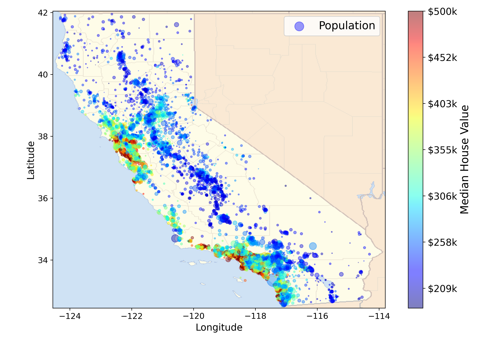

<h1 align="center">House Price Prediction</h1>

<div align= "center">
  <h4>This is a project in which we are going to create a machine learning model to make a prediction of a district&rsquo;s median housing price.</h4>
</div>

# Table of Contents

- [Table of Contents](#table-of-contents)
- [:warning: Frameworks and Libraries](#warning-frameworks-and-libraries)
- [:file_folder: Datasets](#file_folder-datasets)
- [ℹ️ Source](#ℹ️-source)
- [📊 Data description](#-data-description)
  - [Head Values](#head-values)
  - [Data Info](#data-info)
  - [Describing the data](#describing-the-data)
- [📈 Visualising data](#-visualising-data)
  - [🔥 Performance Measure](#-performance-measure)
- [:book: Data Preprocessing](#book-data-preprocessing)
- [:link: Download](#link-download)
- [:key: Prerequisites](#key-prerequisites)
- [🚀&nbsp; Installation](#-installation)
- [:bulb: How to Run](#bulb-how-to-run)
- [📂 Directory Tree](#-directory-tree)
- [:clap: And it's done!](#clap-and-its-done)
- [:raising_hand: Citation](#raising_hand-citation)
- [:heart: Owner](#heart-owner)
- [:eyes: License](#eyes-license)

# :warning: Frameworks and Libraries

- **[SKLearn](https://scikit-learn.org/stable/):** Simple and efficient tools for predictive data analysis
- **[Joblibs](https://joblib.readthedocs.io/en/latest/):**
  Joblib is optimized to be fast and robust on large data in particular and has specific optimizations for numpy arrays.
- **[Matplotlib](https://matplotlib.org/) :** Matplotlib is a comprehensive library for creating static, animated, and interactive visualizations in Python.
- **[Numpy](https://numpy.org/):**
  Caffe-based Single Shot-Multibox Detector (SSD) model used to detect faces
- **[Pandas](https://pandas.pydata.org/):**
  pandas is a fast, powerful, flexible and easy to use open source data analysis and manipulation tool, built on top of the Python programming language.

# :file_folder: Datasets

## ℹ️ Source

This dataset is a modified version of the California Housing dataset available from [Luís Torgo&rsquo;s page](http://www.dcc.fc.up.pt/~ltorgo/Regression/cal_housing.html) (University of Porto). Luís Torgo obtained it from the StatLib repository (which is closed now). The dataset may also be downloaded from StatLib mirrors.

This dataset appeared in a 1997 paper titled <span class="underline">Sparse Spatial Autoregressions</span> by Pace, R. Kelley and Ronald Barry, published in the <span class="underline">Statistics and Probability Letters</span> journal. They built it using the 1990 California census data. It contains one row per census block group. A block group is the smallest geographical unit for which the U.S. Census Bureau publishes sample data (a block group typically has a population of 600 to 3,000 people).

## 📊 Data description

### Head Values

       longitude  latitude  housing_median_age  total_rooms  total_bedrooms  \
    0    -122.23     37.88                41.0        880.0           129.0
    1    -122.22     37.86                21.0       7099.0          1106.0
    2    -122.24     37.85                52.0       1467.0           190.0
    3    -122.25     37.85                52.0       1274.0           235.0
    4    -122.25     37.85                52.0       1627.0           280.0

       population  households  median_income  median_house_value ocean_proximity
    0       322.0       126.0         8.3252            452600.0        NEAR BAY
    1      2401.0      1138.0         8.3014            358500.0        NEAR BAY
    2       496.0       177.0         7.2574            352100.0        NEAR BAY
    3       558.0       219.0         5.6431            341300.0        NEAR BAY
    4       565.0       259.0         3.8462            342200.0        NEAR BAY

### Data Info

    <class 'pandas.core.frame.DataFrame'>
    RangeIndex: 20640 entries, 0 to 20639
    Data columns (total 10 columns):
     #   Column              Non-Null Count  Dtype
    ---  ------              --------------  -----
     0   longitude           20640 non-null  float64
     1   latitude            20640 non-null  float64
     2   housing_median_age  20640 non-null  float64
     3   total_rooms         20640 non-null  float64
     4   total_bedrooms      20433 non-null  float64
     5   population          20640 non-null  float64
     6   households          20640 non-null  float64
     7   median_income       20640 non-null  float64
     8   median_house_value  20640 non-null  float64
     9   ocean_proximity     20640 non-null  object
    dtypes: float64(9), object(1)
    memory usage: 1.6+ MB
    None

### Describing the data

              longitude      latitude  housing_median_age   total_rooms  \
    count  20640.000000  20640.000000        20640.000000  20640.000000
    mean    -119.569704     35.631861           28.639486   2635.763081
    std        2.003532      2.135952           12.585558   2181.615252
    min     -124.350000     32.540000            1.000000      2.000000
    25%     -121.800000     33.930000           18.000000   1447.750000
    50%     -118.490000     34.260000           29.000000   2127.000000
    75%     -118.010000     37.710000           37.000000   3148.000000
    max     -114.310000     41.950000           52.000000  39320.000000

           total_bedrooms    population    households  median_income  \
    count    20433.000000  20640.000000  20640.000000   20640.000000
    mean       537.870553   1425.476744    499.539680       3.870671
    std        421.385070   1132.462122    382.329753       1.899822
    min          1.000000      3.000000      1.000000       0.499900
    25%        296.000000    787.000000    280.000000       2.563400
    50%        435.000000   1166.000000    409.000000       3.534800
    75%        647.000000   1725.000000    605.000000       4.743250
    max       6445.000000  35682.000000   6082.000000      15.000100

           median_house_value
    count        20640.000000
    mean        206855.816909
    std         115395.615874
    min          14999.000000
    25%         119600.000000
    50%         179700.000000
    75%         264725.000000
    max         500001.000000

# 📈 Visualising data



## 🔥 Performance Measure

A typical performance measure for a regression problems is the **_Root Mean Square Error(RMSE)_**. It gives an idea of how much error the system typically makes in it&rsquo;s prediction, with a higher weight for large errors.

Equation of RMSE :

$$\Large RMSE(X,h) = \sqrt{\frac{1}{m} \sum_{i=1}^{m}(h(x^{(i)}) - y^{(i)})^2}$$

# :book: Data Preprocessing

Data pre-processing is an important step for the creation of a machine learning
model. Initially, data may not be clean or in the required format for the model which
can cause misleading outcomes. In pre-processing of data, we transform data into our
required format. It is used to deal with noises, duplicates, and missing values of the
dataset. Data pre-processing has the activities like importing datasets, splitting
datasets, attribute scaling, etc. Preprocessing of data is required for improving the
accuracy of the model.

# :link: Download

The dataset is now available [here](./datasets/housing/housing.csv) !

# :key: Prerequisites

All the dependencies and required libraries are included in the file <code>requirements.txt</code> [See here](requirements.txt)

# 🚀&nbsp; Installation

The Code is written in Python 3.7. If you don&rsquo;t have Python installed you can find it [here](https://www.python.org/downloads/). If you are using a lower version of Python you can upgrade using the pip package, ensuring you have the latest version of pip. To install the required packages and libraries, run this command in the project directory after [cloning](https://www.howtogeek.com/451360/how-to-clone-a-github-repository/) the repository:

1. Clone the repo

```bash
git clone https://github.com/Chaganti-Reddy/House-Price-Prediction.git
```

2. Change your directory to the cloned repo

```bash
cd House-Price-Prediction
```

Before running the command copy the downloaded dataset folder to face-mask-detector folder...

3. Now, run the following command in your Terminal/Command Prompt to install the libraries required

```bash
python3 -m virtualenv my_env

source my_env/bin/activate

pip3 install -r requirements.txt

```

# :bulb: How to Run

1. Open terminal. Go into the cloned project directory and type the following command:

```bash
python3 Housing.py
```

# 📂 Directory Tree

```
├── datasets
│   └── housing
│       ├── housing.csv
│       └── housing.tgz
├── Housing.ipynb
├── images
│   ├── 1.jpeg
│   ├── attribute_histogram_plots.png
│   ├── bad_visualization_plot.png
│   ├── better_visualization_plot.png
│   ├── california_housing_prices_plot.png
│   ├── california.png
│   ├── housing_prices_scatterplot.png
│   ├── income_vs_house_value_scatterplot.png
│   └── scatter_matrix_plot.png
├── my_model.pkl
├── Readme.md
└── requirements.txt
```

# :clap: And it's done!

Feel free to mail me for any doubts/query
:email: chagantivenkataramireddy1@gmail.com

---

# :raising_hand: Citation

You are allowed to cite any part of the code or our dataset. You can use it in your Research Work or Project. Remember to provide credit to the Maintainer Chaganti Reddy by mentioning a link to this repository and her GitHub Profile.

Follow this format:

- Author's name - Chaganti Reddy
- Date of publication or update in parentheses.
- Title or description of document.
- URL.

# :heart: Owner

Made with :heart:&nbsp; by [Chaganti Reddy](https://github.com/Chaganti-Reddy/)

# :eyes: License

MIT © [Chaganti Reddy](https://github.com/Chaganti-Reddy/Face-Mask-Detector/blob/main/LICENSE)
